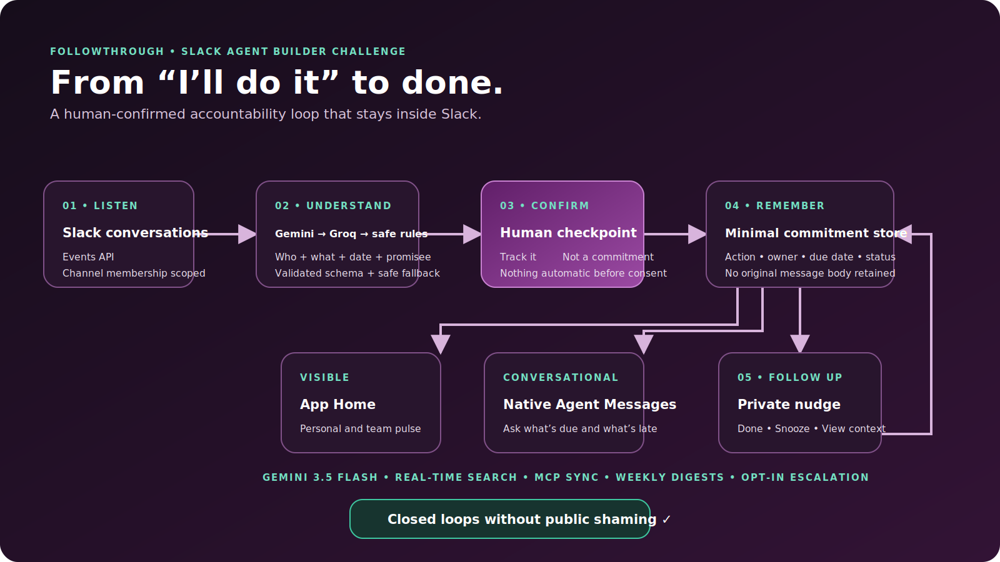
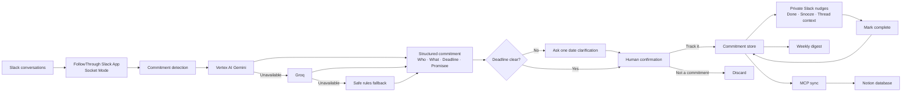

# FollowThrough

**The accountability agent that turns promises in Slack into progress.**

FollowThrough notices commitments such as “I'll send the revised deck by Friday” or “let's circle back next week,” asks a human before tracking anything, and privately nudges the owner until the loop is closed.

Commitment understanding uses a resilient **Gemini → Groq → safe rules** chain. Gemini is the primary structured extractor, Groq provides strict structured output when Gemini is unavailable, and the deterministic detector remains the privacy-safe final fallback.

Built for the [Slack Agent Builder Challenge](https://slackhack.devpost.com/) — **New Slack Agent** track.



## Why it matters

Commitments are already made in Slack, but they disappear into the message stream. Existing task tools require people to stop, copy the promise, open another product, and maintain it. FollowThrough removes that tax while keeping people in control.

The app is deliberately team-agnostic: product launches, recruiting, customer support, nonprofits, classrooms, and volunteer teams all make promises in conversation.

## MVP features

- Watches channels the app has been invited to for explicit first-person or team commitments.
- Parses natural-language dates such as `Friday`, `tomorrow at 3`, and `next week`.
- Turns each detection into structured `who`, `what`, `deadline`, and `promised to` fields.
- Uses Gemini to understand implicit promises such as “leave that with me” and “you'll have the draft tomorrow.”
- Asks once when a deadline is fuzzy instead of silently guessing a weekday.
- Replies in-thread with **Track it** / **Not a commitment** confirmation controls.
- Detects promises made to a mentioned teammate—or the parent author in a thread—and privately includes them in follow-up.
- Pulls the original thread live when nudging, so reminder context is never stale or stored.
- Supports user-triggered Slack Real-time Search with `context: your query` in Agent Messages.
- Sends weekly visual digests with closed, overdue, due-tomorrow, and open counts.
- Supports differentiated overdue reminders and strictly opt-in manager/channel escalation.
- Syncs every tracked update through MCP; the bundled tracker works immediately and can be replaced with a Notion, Linear, or Google Sheets MCP server.
- Supports one-click **Done** and **Snooze 1 day** actions.
- Shows personal or team accountability from the App Home, `/followthrough`, mentions, and Slack's native Agent Messages experience.
- Stores only confirmed commitment metadata; it does not retain the original message body.

## Quick start

### 1. Create a Slack developer sandbox

Join the [Slack Developer Program](https://api.slack.com/developer-program/join) and provision a sandbox. The challenge requires a sandbox URL for judging.

### 2. Create the app from the manifest

1. Open [Your Slack Apps](https://api.slack.com/apps) and choose **Create New App → From an app manifest**.
2. Select the sandbox workspace.
3. Paste [manifest.json](manifest.json), review, and create the app.
4. In **Basic Information → App-Level Tokens**, create a token with `connections:write`.
5. Install the app to the sandbox workspace.

### 3. Configure and run

```bash
npm install
copy .env.example .env
```

Fill in:

- `SLACK_BOT_TOKEN`: the `xoxb-…` token from **OAuth & Permissions**
- `SLACK_APP_TOKEN`: the `xapp-…` token from **Basic Information**
- `SLACK_SIGNING_SECRET`: from **Basic Information**
- `GEMINI_API_KEY`: create locally from [Google AI Studio](https://aistudio.google.com/apikey)
- `GROQ_API_KEY`: create locally from [GroqCloud](https://console.groq.com/keys); it is used only if Gemini fails

Gemini defaults to `gemini-3.5-flash`; Groq defaults to the strict structured-output model `openai/gpt-oss-20b`. Keep `GEMINI_ANALYZE_ALL=false` to send only likely commitment candidates to the AI chain; this reduces API cost and avoids treating ordinary team conversation as surveillance data.

Then run:

```bash
npm start
```

Invite the app to the demo channel:

```text
/invite @FollowThrough
```

### 4. Trigger the happy path

Post in the channel:

```text
I'll send the revised launch deck tomorrow at 3pm.
```

Click **Track it**, then open the app's Home or Messages tab. For an immediate nudge demo, set these values in `.env`, restart, and use a deadline a couple of minutes away:

```dotenv
NUDGE_INTERVAL_MS=10000
NUDGE_LEAD_MINUTES=5
```

## Commands and interactions

| Surface | Interaction |
| --- | --- |
| Channel | Write a commitment with an action and date |
| Agent Messages | “Show my open commitments” or “Give me the team pulse” |
| Agent Messages | `context: launch plan` for live Slack RTS results |
| App Home | View active commitments and mark them done |
| Slash command | `/followthrough mine`, `/followthrough team`, or `/followthrough digest` |
| Mention | `@FollowThrough what do I owe?` |
| Private nudge | **Done** or **Snooze 1 day** |

## Architecture

The app uses Slack's native `agent_view`, Events API, Block Kit, App Home, interactive actions, slash commands, and Socket Mode. It runs as a single Node.js service for a reliable hackathon demo; the persistence adapter can later be swapped for Postgres or DynamoDB without changing Slack handlers.



The submission-ready diagram is available as [docs/architecture.png](docs/architecture.png), with vector and editable sources in [docs/architecture.svg](docs/architecture.svg) and [docs/architecture.mmd](docs/architecture.mmd).

## Trust and privacy

- **Consent:** a detection is only a suggestion until a human clicks **Track it**.
- **No public shaming:** reminders go to the owner by DM.
- **Data minimization:** original message bodies are not persisted.
- **Selective AI:** only messages with broad commitment signals are sent to Gemini by default.
- **Visible provenance:** confirmation cards identify Gemini extraction and show a short evidence summary.
- **Traceability:** each record keeps a Slack permalink so the owner can inspect context.
- **Live context:** source messages are retrieved only when needed and are never copied into the commitment store.
- **Easy correction:** false positives are dismissed in one click; deadlines can be snoozed.
- **Private by default:** promise recipients receive private context; weekly channel digests and escalations require explicit environment flags.
- **Scoped visibility:** the app sees only conversations allowed by its Slack scopes and channel membership.

## RTS and MCP

Slack RTS requires the short-lived `action_token` supplied during a user interaction. For that reason, scheduled nudges retrieve their exact source thread with `conversations.replies`, while user-triggered queries such as `context: launch plan` use `assistant.search.context`. RTS results are rendered immediately and never stored, matching Slack's data-use rules.

The bundled MCP server mirrors normalized commitments to `data/mcp-tracker.json`, proving the complete MCP client/tool flow without another account. The included Notion MCP adapter (`scripts/mcp-notion-server.js`) exposes the same `upsert_commitment` tool over stdio and creates or updates rows in a Notion data source. Configure `MCP_ARGS`, `NOTION_TOKEN`, and `NOTION_DATA_SOURCE_ID` as shown in `.env.example`.

The Notion data source must have these exact properties: `Commitment` (Title), `FollowThrough ID` (Text), `Owner Slack ID` (Text), `Promisee Slack IDs` (Text), `Deadline` (Date), `Status` (Select), `Source` (URL), and `Updated` (Date). Add `pending`, `open`, `overdue`, and `done` as Status options, then share the database with the Notion integration.

Notion's hosted endpoint (`https://mcp.notion.com/mcp`) uses interactive OAuth and does not accept a normal integration token as `MCP_AUTH_TOKEN`. The local adapter is therefore the reliable background-service path for the hackathon. A fully hosted multi-user product should implement Notion MCP's OAuth + PKCE flow instead.

After adding the RTS scope to an existing Slack app, open **App Manifest**, paste the updated [manifest.json](manifest.json), save changes, and reinstall the app from **OAuth & Permissions**.

## Scheduling and escalation

Privacy-first defaults are configured in `.env`:

```dotenv
NUDGE_REPEAT_HOURS=4
DIGEST_DAY=1
DIGEST_HOUR=9
ALLOW_CHANNEL_DIGEST=false
ESCALATION_AFTER_DAYS=0
ALLOW_PUBLIC_ESCALATION=false
```

Set `ESCALATION_AFTER_DAYS` above zero and provide `ESCALATION_MANAGER_USER_ID` to enable private escalation. Public escalation additionally requires both `ALLOW_PUBLIC_ESCALATION=true` and `ESCALATION_CHANNEL_ID`.

## Tests

```bash
npm test
```

The current suite covers positive detection, collaborative “circle back” language, and false-positive guards for statements without a deadline or ownership signal.

## Repository map

```text
src/app.js        Slack events, actions, agent messages, App Home, scheduler
src/gemini-detector.js  Gemini schema, prompting, validation, and rules fallback
src/detector.js   Commitment and natural-language deadline detection
src/store.js      Small durable JSON persistence adapter
src/blocks.js     Block Kit UI builders
test/             Node test suite
docs/             Architecture and Devpost submission materials
manifest.json     Importable Slack app manifest
```

## Next production steps

- Add LLM-based structured extraction behind the same detector interface for implicit promises and multiple commitments per message.
- Add a confirmation modal for editing owner/date before tracking.
- Add per-channel policy controls, quiet hours, and nudge cadence preferences.
- Replace local JSON with encrypted multi-tenant storage and Slack OAuth installation records.
- Add analytics for completion rate and time-to-close without ranking or shaming individuals.
